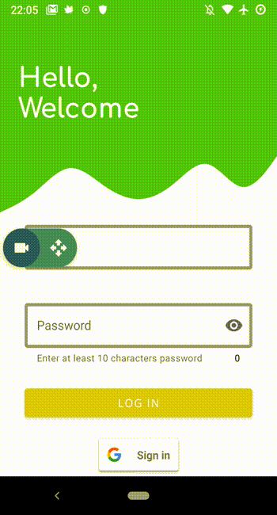

# Note
Note is an android application that allows you to create notes on the go and saves them on the Cloud Firestore so that you don't need to worry about losing your data if you switch to a new device. It also keeps your notes in sync so that you can use it in multiple devices to create, update or delete your notes

## Getting Started
The application supports multiple versions of Android; from KitKat to Android 11. 
If you would like to try the app without building the project, you can download the APK [here](apk/Note.apk) and install it directly on your phone.

### Building the project
#### Prerequisites
* Android Studio
* Android device or emulator
* Access to Firebase console

#### Setup
* Add the project to your firebase console and generate a google-services JSON file and store it in the app/ directory
* Build the project and install it in an emulator or an Android phone to try the application

## Built With
* Material Design Components
* RxJava3
* Lottie
* Firebase
* Gradle
* Jetpack libraries

## Authors
* [Sijan Rijal](https://github.com/sijanr)

## Images and Icons attributions
* Icon made by [Freepik](https://www.flaticon.com/authors/freepik) from "https://www.flaticon.com/"
* [Person Vectors by Vecteezy](https://www.vecteezy.com/free-vector/person)
* <a href="https://www.freepik.com/vectors/coffee">Coffee vector created by stories - www.freepik.com</a>
* <a href="https://iconscout.com/icon/menu-2694328">Menu Icon by Unicons Font</a>

## License
See the [LICENSE.md](LICENSE) for details
